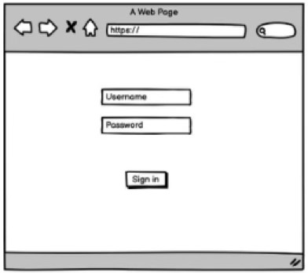
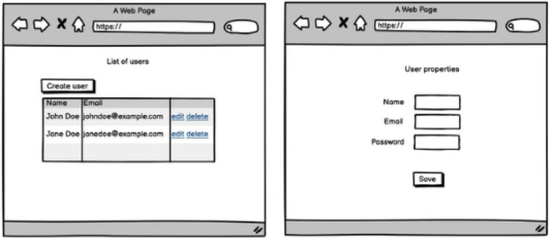
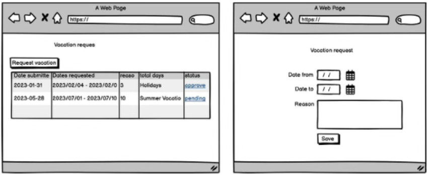

# Developer Assignment

  

This assignment aims to assess your technical skills and provide discussion points for your technical interview. 

Please note that the assignment is entirely fictional and has no connection to our products or business. It will not be used commercially or in any other form.

## Overview

Your company has grown rapidly, tripling in size over the past few years. However, the vacation management process has not kept up, relying on outdated methods such as handwritten applications, manual approvals, and physical records.

Your task is to design and build an online portal streamlining this process. The portal should:

* Allow employees to submit vacation requests online.  
* Notify managers to approve or reject requests.

## Scenarios

The following scenarios define how managers and employees interact with the portal. They cover tasks like signing in, managing accounts, and handling vacation requests.

### Feature: Manager account

**Background:**

**Given** that I have a manager account in the system

#### **Scenario:** Signing into the portal as manager

**When** I sign in using my username and password  
**Then** I am taken to the manager home page  
**And** I can see a list of users currently registered in the system  
**And** I can create a new user  
**And** I can sign out of my account

#### **Scenario:** Viewing the list of users

**When** I view the list of users  
**Then** I see all users registered  
**And** for each user, I see their name  
**And** I see their email  
**And** I can update the user’s properties  
**And** I can delete the user

#### **Rule:** User management

#### **Scenario:** Creating a user

**When** I go to create a user  
**Then** I can enter the user’s name  
**And** I can enter the user’s email address  
**And** I can enter the user’s “employee\_code”, a 7-digit employee number  
**And** I can enter a password for the user

#### **Scenario:** Updating a user

**When** I go to update a user  
**Then** I can change their name  
**And** I can change their email address  
**And** I can set a new password

#### **Scenario:** Deleting a user

**When** I delete a user  
**Then** the user is deleted  
**And** all of their associated data is also deleted

#### **Rule:** Request management

#### **Scenario:** Receiving a vacation request

**When** a vacation request is submitted  
**Then** I can approve the request  
**And** I can reject the request

#### **Scenario:** Approving a vacation request

**When** I approve the request  
**Then** the request is marked as approved

#### **Scenario:** Rejecting a vacation request

**When** I reject the request  
**Then** the request is marked as rejected

### Feature: Employee account

**Background:**

**Given** that I have an employee account in the system

#### **Scenario:** Signing into the portal as an employee

**When** I sign in using my username and password  
**Then** I am taken to the employee home page  
**And** I can see a list of submitted vacation requests  
**And** I can create a new request  
**And** I can sign out of my account

#### **Scenario:** Viewing the list of requests

**When** I view the list of requests  
**Then** I see all requests submitted  
**And** for each request, I see the date it was submitted  
**And** I see the dates requested  
**And** I see the status of the request, approved, rejected, or pending  
**And** I can delete the request if it is pending

#### **Scenario:** Creating a new vacation request

**When** I go to create a new vacation request  
**Then** I can select the date range of the requested vacation  
**And** I can enter a reason for the request 

## Wireframes

The following wireframes are a visual guide to the portal’s layout, highlighting key pages like dashboards, forms, and lists. They serve as a starting point and can be adjusted to meet technical needs or improve usability.

### Sign in

### Manager journey

### Employee journey

## Evaluation

Your work will be evaluated on:

* **Code Quality**: Readability, consistency, and adherence to best practices.
* **Database Design**: How effectively your database structure supports the application's functionality.
* **Development Practices**: Using the build in tools for unit tests, linters, or static analysis will be viewed positively.
* **Security Practices**: Implementation of security measures, such as data validation, secure authentication, and proper handling of sensitive data.
* **Feature Completion**: The portal’s ability to handle the core requirements smoothly and reliably.

Some details in this assignment are intentionally left open-ended. You are encouraged to use your judgment and make independent decisions to address any ambiguities or expand the functionality as you see fit.

If you have any questions or need clarification about the assignment, please don’t hesitate to reach out. We encourage open communication and are happy to help you succeed in completing the assignment.
